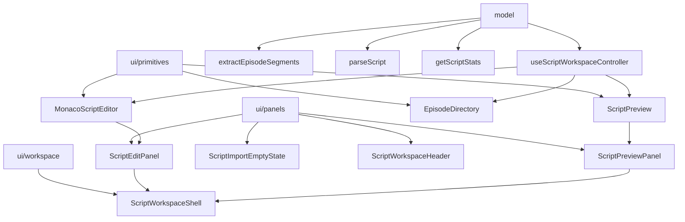

# Text Editor Component Design

## Overview

`text-editor` is a composable screenplay text workspace module for full-script editing, directory navigation, and structured preview.

It is designed around three goals:

1. Keep the full screenplay text as the single source of truth
2. Allow editor, preview, and directory to be used independently
3. Support a batteries-included workspace without forcing all consumers into one integration style

## Design Principles

### Full Script First

The editor always works with the complete screenplay text. Episode selection is navigation only and must not split the editor content.

Episode navigation uses a shared line-based contract:

- `EpisodeSegment.startLine` is the reveal target
- editor and preview both consume that line-based navigation input
- preview should prefer exact rendered anchors before scene-level approximation

### Headless State, Styled UI

State management and parsing live in `model/*`. UI components consume those capabilities but are not the source of truth.

### Primitive vs Panel Separation

Low-level components stay reusable and business-agnostic. Business-specific empty states and workflow entry points belong in panel components.

### Configurable Empty State

An empty editor is not a single product rule. Different business flows may require:

- import-first onboarding
- direct writing
- a custom entry surface

This is handled by `ScriptEditPanel`, not by `MonacoScriptEditor`.

## Architecture



## Module Layout

```text
text-editor/
  model/
    useScriptWorkspaceController.ts
    ScriptWorkspaceContext.tsx
    episode-directory.ts
    parseScript.ts
    script-stats.ts
  ui/
    primitives/
      MonacoScriptEditor.tsx
      ScriptPreview.tsx
      EpisodeDirectory.tsx
      monaco-theme.ts
    panels/
      ScriptEditPanel.tsx
      ScriptImportEmptyState.tsx
      ScriptPreviewPanel.tsx
      ScriptWorkspaceHeader.tsx
    workspace/
      ScriptWorkspaceShell.tsx
```

## Public API Layers

### 1. Headless Model

Public exports:

- `useScriptWorkspaceController`
- `extractEpisodeSegments`
- `parseScript`
- `getScriptStats`
- `ScriptWorkspaceProvider`
- `useScriptWorkspaceContext`

Use this layer when you want full control over UI composition.

### 2. UI Primitives

Public exports:

- `MonacoScriptEditor`
- `ScriptPreview`
- `EpisodeDirectory`
- `registerScriptMonaco`

Use this layer when you want one standalone capability without the default workspace shell.

### 3. Panels and Workspace

Public exports:

- `ScriptEditPanel`
- `ScriptImportEmptyState`
- `ScriptPreviewPanel`
- `ScriptWorkspaceHeader`
- `ScriptWorkspaceShell`

Use this layer when you want the default product-level experience.

## Core Data Model

### EpisodeSegment

Produced by `extractEpisodeSegments`.

```ts
interface EpisodeSegment {
  id: string
  index: number
  title: string
  summary: string
  content: string
  start: number
  end: number
  startLine: number
  endLine: number
  sceneCount: number
  wordCount: number
}
```

This is a navigation model and is intentionally public.

### Scene

Produced by `parseScript`.

```ts
interface Scene {
  id: string
  number: string
  timeOfDay: string
  interior: string
  location: string
  characters: string[]
  blocks: ScriptBlock[]
  startLine: number
}
```

This is the preview rendering model.

### ScriptBlock

Produced inside `parseScript`.

Important detail:

- each parsed block carries its source `line`
- preview uses that line value to create exact reveal anchors

## Controller Contract

`useScriptWorkspaceController()` is the default headless state entry point.

It exposes:

- `content`
- `isEmpty`
- `fileName`
- `activeTab`
- `episodes`
- `activeEpisode`
- `previewContent`
- `stats`
- `setContent`
- `setActiveTab`
- `selectEpisode`
- `importFile`

Responsibilities:

- maintain full script text
- derive episode navigation from text
- derive preview input from text
- track active tab and active episode
- import `txt` and `docx`

Non-responsibilities:

- deciding which empty state to render
- deciding header style
- deciding tab style
- deciding sidebar presentation

## Component Responsibilities

### MonacoScriptEditor

Responsibilities:

- render Monaco
- register screenplay highlighting
- reveal a target line in the full document
- align episode navigation near the top edge of the editor viewport

Non-responsibilities:

- import workflow
- empty-state logic
- business onboarding

### ScriptPreview

Responsibilities:

- parse script text into `Scene[]`
- render structured preview cards
- reveal the exact rendered block for a target line when possible
- fall back to the nearest earlier scene anchor when no exact block anchor exists

Interaction refinement:

- short-distance jumps may remain smooth
- large-distance jumps should avoid long smooth-scroll animations
- scroll calculations must be relative to the preview scroller itself

### EpisodeDirectory

Responsibilities:

- render episode list
- display summary and counts
- notify selection

### ScriptEditPanel

Responsibilities:

- decide what the edit tab renders when content is empty
- forward editing props to `MonacoScriptEditor`
- support configurable empty-state strategy

Supported empty-state strategies:

- `import`
- `editable`
- `custom`

### ScriptWorkspaceShell

Responsibilities:

- provide the layout frame
- render left directory and right workspace
- switch tabs between edit and preview panes

Non-responsibilities:

- fetching or storing text
- parsing script data
- handling imports

## Empty State Strategy

`ScriptEditPanel` supports three modes:

### `import`

Show the default business-oriented import empty state.

### `editable`

Skip empty-state UI and render the editor immediately.

### `custom`

Allow the consumer to render a custom empty state through `renderEmptyState`.

This design keeps the primitive editor reusable while still supporting product-specific onboarding.

## Props Drilling Strategy

The module supports two integration styles:

### Explicit Prop Composition

Best for simple pages and local clarity.

### Context-Based Composition

Best for a full workspace tree with many internal consumers.

`ScriptWorkspaceContext` is optional by design. Consumers are not required to use context if they prefer headless composition.

## Reveal Strategy

### Shared Reveal Input

The workspace shares one reveal signal across editor and preview:

- `activeEpisode?.startLine`

This keeps episode navigation consistent without splitting the underlying content.

### Preview Reveal Strategy

Preferred order:

1. exact rendered block anchor via parsed block `line`
2. nearest earlier scene anchor

Rationale:

- episode headers are not always equivalent to scene starts
- scene-only reveal is too approximate for reliable episode navigation

### Editor Reveal Strategy

Rejected options:

- center-aligned reveal via Monaco defaults
- loosely top-biased reveal that still preserves significant offset

Accepted option:

- explicit scroll positioning using Monaco line metrics so the target line appears near the top edge

## Extension Guidance

### Add a New Syntax Type

1. Update `script-syntax/*`
2. Update `model/parseScript.ts`
3. Update `ui/primitives/ScriptPreview.tsx`
4. Update `ui/primitives/monaco-theme.ts`
5. Add fixtures and tests

### Replace the Import Empty State

Choose one:

- keep `ScriptEditPanel` and pass `emptyStateStrategy="custom"`
- replace `ScriptImportEmptyState`
- bypass panel logic and use `MonacoScriptEditor` directly

### Add More Workspace Tabs

Evolve `ScriptWorkspaceShell` from fixed edit/preview slots into a tab config API.

## Tradeoffs

### Why not export only one big workspace component

That would be convenient initially, but it would tightly couple:

- editing
- previewing
- directory navigation
- business onboarding

This module intentionally avoids that coupling.

### Why not make everything context-only

Context-only APIs are easy to wire internally but reduce portability and make isolated usage harder. The current design keeps headless composition as the primary integration path.

## Recommended Default Usage

For product pages, prefer:

1. `useScriptWorkspaceController`
2. `ScriptWorkspaceShell`
3. `EpisodeDirectory`
4. `ScriptEditPanel`
5. `ScriptPreviewPanel`

For specialized pages, prefer primitives or model functions directly.
