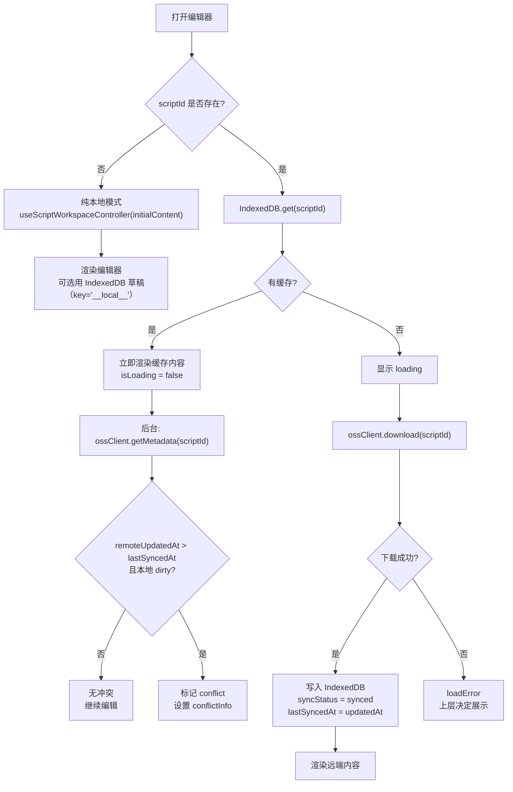
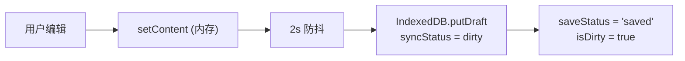
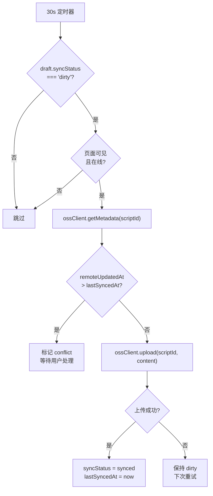
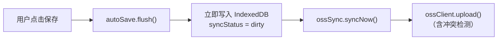
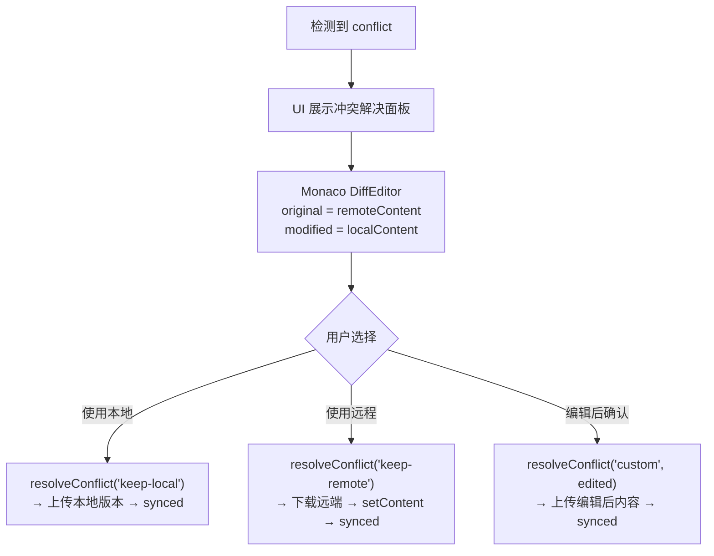

# Text Editor Persistence Design

## Overview

`text-editor` 需要支持将剧本内容实时保存到 IndexedDB，并在业务场景下定时同步到 OSS。

本文档描述持久化与同步的架构设计。所有相关代码收敛在 `text-editor/` 目录内，不依赖项目级 `features/` 或 `shared/`，确保模块可以整体迁移到其他项目。

## 设计原则

### 自包含

持久化相关代码（IndexedDB、auto-save、OSS 同步）全部位于 `text-editor/model/` 下。迁移时拷贝整个目录即可，仅需：

1. 安装 `mammoth`（docx 导入）
2. 安装 `idb-keyval`（IndexedDB 操作）
3. 实现 `oss-client.ts`（对接目标项目的 OSS 接口）

### 分层不变

`useScriptWorkspaceController` 保持 headless 不变。持久化通过新的组合 hook `useScriptDraftController` 接入，原有 controller 的消费者无需改动。

### 状态即数据

所有持久化状态（保存中、已保存、dirty、冲突等）从 hook 返回为普通数据，UI 可在任意位置消费。保存操作暴露为纯函数，不绑定具体 UI。

### OSS 留空

定义接口和类型，实现为 stub。迁移到目标项目后替换 `oss-client.ts` 即可启用。

## 数据模型

### DraftRecord

存储在 IndexedDB 中的草稿记录。

```ts
interface DraftRecord {
  /** 主键，scriptId 或 '__local__'（纯本地草稿） */
  id: string
  /** 剧本全文 */
  content: string
  /** 文件名 */
  fileName: string
  /** 本地最后修改时间 */
  localUpdatedAt: number
  /** 最后一次成功同步到远端的时间 */
  lastSyncedAt: number | null
  /** 同步状态 */
  syncStatus: 'synced' | 'dirty' | 'conflict'
}
```

### ConflictInfo

冲突发生时暴露给 UI 的信息。

```ts
interface ConflictInfo {
  /** 本地修改内容 */
  localContent: string
  /** 远端最新内容 */
  remoteContent: string
  /** 本地最后修改时间 */
  localUpdatedAt: number
  /** 远端最后更新时间 */
  remoteUpdatedAt: number
}
```

### SaveStatus

自动保存的即时状态。

```ts
type SaveStatus = 'idle' | 'saving' | 'saved' | 'error'
```

## 目录结构

```text
text-editor/
  model/
    useScriptWorkspaceController.ts     # 不改
    ScriptWorkspaceContext.tsx           # 不改
    episode-directory.ts                # 不改
    parseScript.ts                      # 不改
    script-stats.ts                     # 不改
    index.ts                            # 增加 export

    storage/
      types.ts                          # DraftRecord
      use-draft-storage.ts              # idb-keyval 封装 + React hook

    sync/
      types.ts                          # SyncStatus, ConflictInfo, SaveStatus
      use-auto-save.ts                  # 2s 防抖 → IndexedDB
      use-oss-sync.ts                   # 30s 定时同步到远端（当前 stub）
      conflict-detector.ts              # 纯函数：冲突检测 + 解决
      oss-client.ts                     # 远端接口定义 + stub 实现

    useScriptDraftController.ts         # 组合 hook

  ui/
    primitives/                         # 不改
    panels/
      ConflictResolutionPanel.tsx       # 可选的冲突解决面板（Monaco DiffEditor）
      ...                               # 其余不改
    workspace/                          # 不改
  script-syntax/                        # 不改
  index.ts                              # 增加 export
```

## 核心模块

### `storage/types.ts`

```ts
export type SyncStatus = 'synced' | 'dirty' | 'conflict'

export interface DraftRecord {
  id: string
  content: string
  fileName: string
  localUpdatedAt: number
  lastSyncedAt: number | null
  syncStatus: SyncStatus
}
```

### `storage/use-draft-storage.ts`

基于 `idb-keyval` 的草稿存储 hook。

职责：

- 从 IndexedDB 异步加载草稿
- 提供写入、删除方法
- 管理 loading / error 状态

```ts
interface UseDraftStorageReturn {
  /** 当前草稿记录 */
  draft: DraftRecord | null
  /** 是否正在加载 */
  isLoading: boolean
  /** 加载错误 */
  loadError: Error | null
  /** 写入草稿 */
  saveDraft: (content: string, fileName: string, syncStatus?: SyncStatus) => Promise<void>
  /** 更新部分字段 */
  updateDraft: (partial: Partial<DraftRecord>) => Promise<void>
  /** 删除草稿 */
  removeDraft: () => Promise<void>
}

function useDraftStorage(id: string | undefined): UseDraftStorageReturn
```

实现要点：

- `id` 为 `undefined` 时，使用 `'__local__'` 作为 key
- 初始化时从 IndexedDB 加载，加载完成前 `isLoading = true`
- `saveDraft` 同时更新 `localUpdatedAt = Date.now()`
- `idb-keyval` 的 `get` / `set` / `del` 足以覆盖所有操作

### `sync/types.ts`

```ts
export type { SyncStatus } from '../storage/types'
export type { ConflictInfo } from '../storage/types'
export type SaveStatus = 'idle' | 'saving' | 'saved' | 'error'
```

### `sync/use-auto-save.ts`

防抖写入 IndexedDB。

职责：

- 监听 content 变化
- 2s 防抖后写入 IndexedDB，标记 `syncStatus = 'dirty'`
- 管理 `saveStatus` 状态
- 提供 `flush()` 立即保存（跳过防抖）

```ts
interface UseAutoSaveReturn {
  /** 当前保存状态 */
  saveStatus: SaveStatus
  /** 是否有未保存的修改 */
  isDirty: boolean
  /** 最后一次成功保存到 IndexedDB 的时间 */
  lastSavedAt: number | null
  /** 立即保存（跳过防抖） */
  flush: () => Promise<void>
}

function useAutoSave(
  id: string | undefined,
  content: string,
  fileName: string,
  saveDraft: UseDraftStorageReturn['saveDraft'],
  options?: { debounceMs?: number }
): UseAutoSaveReturn
```

实现要点：

- 使用 `useRef` + `setTimeout` 实现防抖，不引入外部 debounce 库
- 每次 `content` 变化重置计时器
- `flush` 清除计时器并立即执行保存
- `saveStatus` 在保存开始时置 `'saving'`，成功置 `'saved'`，失败置 `'error'`
- 组件卸载时执行 `flush`（`useEffect` cleanup），避免丢失最后的修改

### `sync/use-oss-sync.ts`

定时同步到远端。

职责：

- 每 30s 检查 dirty 条目
- 调用 `oss-client` 上传 / 下载
- 管理同步状态和冲突状态
- 页面不可见时暂停定时器

```ts
interface UseOssSyncReturn {
  /** 是否正在同步 */
  isSyncing: boolean
  /** 同步错误 */
  syncError: Error | null
  /** 冲突信息 */
  conflictInfo: ConflictInfo | null
  /** 立即触发同步 */
  syncNow: () => Promise<void>
  /** 解决冲突 */
  resolveConflict: (strategy: 'keep-local' | 'keep-remote' | 'custom', customContent?: string) => void
}

function useOssSync(
  id: string | undefined,
  draft: DraftRecord | null,
  updateDraft: UseDraftStorageReturn['updateDraft'],
  setContent: (content: string) => void,
): UseOssSyncReturn
```

实现要点：

- `useEffect` + `setInterval(30s)` 驱动
- `document.addEventListener('visibilitychange')` 检测页面可见性，隐藏时暂停
- 仅在 `draft.syncStatus === 'dirty'` 且 `id !== undefined` 时尝试同步
- 同步前调用 `conflict-detector.ts` 检测冲突
- 检测到冲突时不自动上传，设置 `conflictInfo` 等待用户处理
- 当前 `oss-client` 为 stub，所有同步操作 no-op（不 throw，静默跳过）

### `sync/conflict-detector.ts`

纯函数，不依赖 React。

```ts
/**
 * 检测冲突
 * 条件：本地 dirty 且 lastSyncedAt < remoteUpdatedAt
 */
function detectConflict(
  draft: DraftRecord,
  remoteUpdatedAt: number
): ConflictInfo | null

/**
 * 解决冲突
 * 返回更新后的 DraftRecord
 */
function resolveConflict(
  draft: DraftRecord,
  strategy: 'keep-local' | 'keep-remote' | 'custom',
  remoteContent: string,
  remoteUpdatedAt: number,
  customContent?: string
): DraftRecord
```

三种解决策略：

| 策略 | 行为 |
|------|------|
| `keep-local` | 保留本地内容，覆盖远端（上传后标记 synced） |
| `keep-remote` | 丢弃本地修改，使用远端内容（下载后标记 synced） |
| `custom` | 使用用户编辑后的内容（上传后标记 synced） |

### `sync/oss-client.ts`

远端接口定义 + stub 实现。

```ts
export interface OssClient {
  /** 上传剧本内容到远端 */
  upload(scriptId: string, content: string): Promise<{ updatedAt: number }>
  /** 从远端下载剧本内容 */
  download(scriptId: string): Promise<{ content: string; updatedAt: number }>
  /** 获取远端元数据（仅 updatedAt） */
  getMetadata(scriptId: string): Promise<{ updatedAt: number }>
}

/** Stub 实现，迁移时替换 */
export const ossClient: OssClient = {
  async upload() {
    // stub: 返回当前时间作为 updatedAt
    return { updatedAt: Date.now() }
  },
  async download() {
    // stub: 返回空内容
    return { content: '', updatedAt: Date.now() }
  },
  async getMetadata() {
    // stub: 返回 0 表示无远端记录
    return { updatedAt: 0 }
  },
}
```

迁移时只需替换此文件中的 `ossClient` 实现。

### `useScriptDraftController.ts`

组合 hook，串联所有持久化能力。

```ts
interface UseScriptDraftControllerOptions {
  /** 剧本 ID，有值时启用 IndexedDB 持久化 + 远端同步 */
  scriptId?: string
  /** 初始内容（仅无 scriptId 的纯本地模式使用） */
  initialContent?: string
  /** 初始文件名 */
  initialFileName?: string
}
```

返回值包含三组：

```ts
{
  // ── 原有 controller 能力（透传，不变） ──
  content, isEmpty, fileName, activeTab, episodes, activeEpisode,
  previewContent, stats, setActiveTab, setContent, selectEpisode, importFile,

  // ── 持久化状态（UI 可在任何位置消费） ──
  isLoading: boolean,
  loadError: Error | null,
  saveStatus: 'idle' | 'saving' | 'saved' | 'error',
  isDirty: boolean,
  lastSavedAt: number | null,
  syncStatus: 'synced' | 'dirty' | 'conflict',
  lastSyncedAt: number | null,
  isSyncing: boolean,
  syncError: Error | null,
  conflictInfo: ConflictInfo | null,

  // ── 操作（headless actions） ──
  saveNow: () => Promise<void>,
  syncNow: () => Promise<void>,
  resolveConflict: (strategy: 'keep-local' | 'keep-remote' | 'custom', customContent?: string) => void,
}
```

## 数据流

### 打开编辑器



### 编辑内容



### 定时同步



### 手动保存



### 冲突解决



## 冲突解决 UI

`ConflictResolutionPanel` 是可选的冲突解决面板组件，使用 Monaco `DiffEditor` 实现。

### 设计理由

- 项目已依赖 `@monaco-editor/react`，`DiffEditor` 是内置组件，零额外成本
- 用户可以在对比视图中直接编辑 `modified` 侧内容
- 支持三种解决路径：保留本地、保留远程、自定义编辑后确认

### 接口

```tsx
interface ConflictResolutionPanelProps {
  conflictInfo: ConflictInfo
  onResolve: (strategy: 'keep-local' | 'keep-remote' | 'custom', customContent?: string) => void
  className?: string
}
```

### 使用方式

```tsx
{draft.conflictInfo && (
  <ConflictResolutionPanel
    conflictInfo={draft.conflictInfo}
    onResolve={draft.resolveConflict}
  />
)}
```

此组件是**可选**的。上层可以完全自己实现冲突 UI，只需要消费 `conflictInfo` 数据 + 调用 `resolveConflict` 方法。

## API 参考

### `useScriptDraftController(options?)`

组合 hook，串联 `useScriptWorkspaceController` + IndexedDB 持久化 + OSS 同步。

Options:

```ts
interface UseScriptDraftControllerOptions {
  /** 剧本 ID，有值时启用持久化 + 远端同步 */
  scriptId?: string
  /** 初始内容（仅无 scriptId 时使用） */
  initialContent?: string
  /** 初始文件名 */
  initialFileName?: string
}
```

Returns:

| 属性 | 类型 | 说明 |
|------|------|------|
| `content` | `string` | 当前剧本文本 |
| `isEmpty` | `boolean` | 内容是否为空 |
| `fileName` | `string` | 文件名 |
| `activeTab` | `'edit' \| 'preview'` | 当前 tab |
| `episodes` | `EpisodeSegment[]` | 分集目录 |
| `activeEpisode` | `EpisodeSegment \| null` | 当前选中集 |
| `previewContent` | `string` | 预览用的延迟内容 |
| `stats` | `ScriptStats` | 统计信息 |
| `setActiveTab` | `(tab) => void` | 切换 tab |
| `setContent` | `(content) => void` | 设置内容 |
| `selectEpisode` | `(index) => void` | 选择集 |
| `importFile` | `(file) => Promise<void>` | 导入文件 |
| `isLoading` | `boolean` | 是否正在从 IndexedDB 或远端加载 |
| `loadError` | `Error \| null` | 加载错误 |
| `saveStatus` | `SaveStatus` | 自动保存状态 |
| `isDirty` | `boolean` | 是否有未保存修改 |
| `lastSavedAt` | `number \| null` | 最后保存到 IndexedDB 的时间戳 |
| `syncStatus` | `SyncStatus` | 同步状态 |
| `lastSyncedAt` | `number \| null` | 最后同步到远端的时间戳 |
| `isSyncing` | `boolean` | 是否正在同步 |
| `syncError` | `Error \| null` | 同步错误 |
| `conflictInfo` | `ConflictInfo \| null` | 冲突信息 |
| `saveNow` | `() => Promise<void>` | 立即保存到 IndexedDB |
| `syncNow` | `() => Promise<void>` | 立即同步到远端 |
| `resolveConflict` | `(strategy, customContent?) => void` | 解决冲突 |

### `ConflictResolutionPanel`

可选的冲突解决面板。

Props:

```ts
interface ConflictResolutionPanelProps {
  conflictInfo: ConflictInfo
  onResolve: (strategy: 'keep-local' | 'keep-remote' | 'custom', customContent?: string) => void
  className?: string
}
```

## 使用示例

### 纯本地模式（当前 drama-editor 项目）

```tsx
function TextEditorPage() {
  const draft = useScriptDraftController()

  return (
    <ScriptWorkspaceShell
      activeTab={draft.activeTab}
      onTabChange={draft.setActiveTab}
      header={
        <ScriptWorkspaceHeader
          fileName={draft.fileName}
          episodeCount={draft.episodes.length}
          stats={draft.stats}
          onImport={draft.importFile}
        />
      }
      editPane={
        <ScriptEditPanel
          content={draft.content}
          onChange={draft.setContent}
          revealLine={draft.activeEpisode?.startLine}
          emptyStateStrategy="import"
          onImport={draft.importFile}
        />
      }
      previewPane={
        <ScriptPreviewPanel
          content={draft.previewContent}
          revealLine={draft.activeEpisode?.startLine}
        />
      }
    />
  )
}
```

### 带 scriptId + 远端同步（迁移后项目）

```tsx
function ScriptEditPage() {
  const { scriptId } = useParams()
  const draft = useScriptDraftController({ scriptId })

  if (draft.isLoading) return <Skeleton />
  if (draft.loadError) return <ErrorDisplay error={draft.loadError} />

  return (
    <>
      <ScriptWorkspaceShell
        header={
          <>
            <SaveStatusBadge
              saveStatus={draft.saveStatus}
              isDirty={draft.isDirty}
              lastSavedAt={draft.lastSavedAt}
            />
            <button onClick={draft.saveNow} disabled={draft.saveStatus === 'saving'}>
              {draft.saveStatus === 'saving' ? '保存中...' : '保存'}
            </button>
          </>
        }
        // ... 其余 props 同上
      />

      {draft.conflictInfo && (
        <ConflictResolutionPanel
          conflictInfo={draft.conflictInfo}
          onResolve={draft.resolveConflict}
        />
      )}
    </>
  )
}
```

### 自定义保存状态 UI（headless）

```tsx
function CustomStatusBar({ draft }: { draft: ReturnType<typeof useScriptDraftController> }) {
  return (
    <div className="status-bar">
      <span>{draft.isDirty ? '● 未保存' : '✓ 已保存'}</span>
      {draft.isSyncing && <span>同步中...</span>}
      <button onClick={draft.saveNow}>保存</button>
    </div>
  )
}
```

保存状态可以在**任何位置**消费，不限于特定组件树。

## 与现有模块的关系

### 不改动的部分

| 文件 | 说明 |
|------|------|
| `useScriptWorkspaceController.ts` | 保持 headless，不改 |
| `ScriptWorkspaceContext.tsx` | 保持可选 context，不改 |
| `ui/primitives/*` | 所有 primitive 不改 |
| `ui/panels/ScriptEditPanel.tsx` | 不改 |
| `ui/panels/ScriptPreviewPanel.tsx` | 不改 |
| `ui/panels/ScriptWorkspaceHeader.tsx` | 不改 |
| `ui/workspace/ScriptWorkspaceShell.tsx` | 不改 |
| `script-syntax/*` | 不改 |

### 新增的部分

| 文件 | 说明 |
|------|------|
| `model/storage/types.ts` | DraftRecord 数据模型 |
| `model/storage/use-draft-storage.ts` | IndexedDB 草稿 hook |
| `model/sync/types.ts` | 同步相关类型 |
| `model/sync/use-auto-save.ts` | 防抖自动保存 |
| `model/sync/use-oss-sync.ts` | 定时同步到远端 |
| `model/sync/conflict-detector.ts` | 冲突检测纯函数 |
| `model/sync/oss-client.ts` | 远端接口 + stub |
| `model/useScriptDraftController.ts` | 组合 hook |
| `ui/panels/ConflictResolutionPanel.tsx` | 可选冲突解决面板 |

### index.ts 新增 export

```ts
export { useScriptDraftController } from './model/useScriptDraftController'
export type { UseScriptDraftControllerOptions } from './model/useScriptDraftController'
export type { DraftRecord, SyncStatus } from './model/storage/types'
export type { ConflictInfo, SaveStatus } from './model/sync/types'
export { ConflictResolutionPanel } from './ui/panels/ConflictResolutionPanel'
```

## 实现顺序

建议按依赖关系从底向上实现：

1. `model/storage/types.ts` — 数据模型定义
2. `model/storage/use-draft-storage.ts` — IndexedDB 基础操作
3. `model/sync/types.ts` — 同步类型定义
4. `model/sync/oss-client.ts` — 远端接口 + stub
5. `model/sync/conflict-detector.ts` — 纯函数，可独立测试
6. `model/sync/use-auto-save.ts` — 防抖保存
7. `model/sync/use-oss-sync.ts` — 定时同步
8. `model/useScriptDraftController.ts` — 组合 hook
9. `ui/panels/ConflictResolutionPanel.tsx` — 可选冲突 UI
10. `index.ts` — 新增 export
11. 更新 `COMPONENT_DESIGN.md` 架构图
12. 更新 `USAGE.md` 新增持久化使用指南

## 迁移清单

将 `text-editor/` 迁移到目标项目时：

1. 拷贝整个 `text-editor/` 目录
2. `npm install idb-keyval mammoth`
3. 实现 `model/sync/oss-client.ts` 中的 `ossClient`（对接目标项目的 OSS 签名 URL 接口）
4. 页面使用 `useScriptDraftController({ scriptId })` 替代 `useScriptWorkspaceController()`
5. 完成

## Tradeoffs

### 为什么不引入 Zustand persist

`text-editor` 的状态管理模式是纯 React hooks（`useState + useMemo`），不使用 Zustand。为了保持自包含和迁移一致性，持久化层也使用纯 React hooks + 直接调用 IndexedDB，不引入新的状态管理范式。

如果目标项目使用 Zustand，迁移时可以在 `useScriptDraftController` 内部替换为 Zustand store，上层接口不变。

### 为什么用 idb-keyval 而不是 idb 或 dexie

`text-editor` 的 IndexedDB 使用场景是**单表、主键查询、无索引、无关联**。`idb-keyval` 足以覆盖所有操作（`get / set / del`），体积最小（~600B），迁移时不与目标项目可能已有的 IndexedDB 方案冲突。

如果后续需要多表、索引、事务等能力，可以替换为 `idb`，接口变动仅限于 `model/storage/` 内部。

### 为什么 auto-save 在 model 层而不是 feature 层

本项目的 `features/auto-save/` 是给旧 Tiptap 编辑器用的，数据格式（JSON）和保存目标（HTTP PATCH）与 `text-editor` 完全不同。

将 auto-save 收敛在 `text-editor/model/` 内可以：
- 保持模块自包含
- 避免与旧 feature 的耦合
- 迁移时不需要额外搬移 feature 代码
